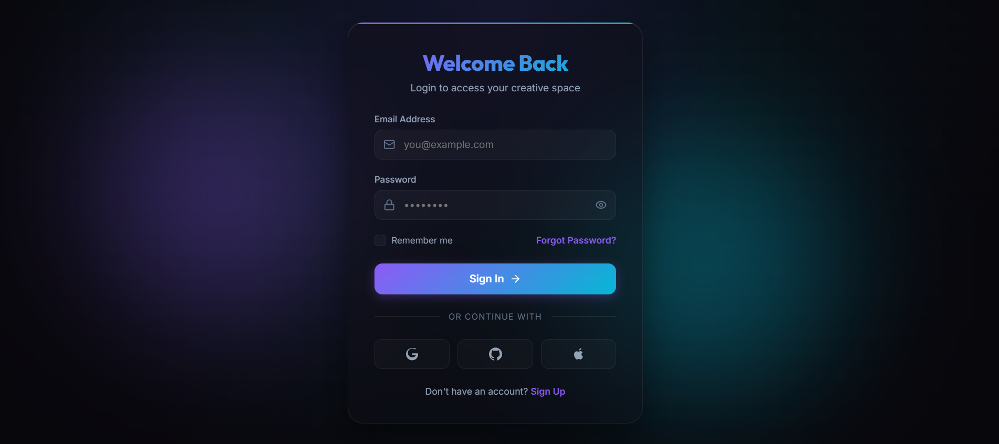

# React + Vite

This template provides a minimal setup to get React working in Vite with HMR and some Oxlint rules.

Currently, two official plugins are available:

- [@vitejs/plugin-react](https://github.com/vitejs/vite-plugin-react/blob/main/packages/plugin-react) uses [Oxc](https://oxc.rs)
- [@vitejs/plugin-react-swc](https://github.com/vitejs/vite-plugin-react/blob/main/packages/plugin-react-swc) uses [SWC](https://swc.rs/)

## React Compiler

The React Compiler is not enabled on this template because of its impact on dev & build performances. To add it, see [this documentation](https://react.dev/learn/react-compiler/installation).

## Expanding the Oxlint configuration

If you are developing a production application, we recommend using TypeScript with type-aware lint rules enabled. Check out the [TS template](https://github.com/vitejs/vite/tree/main/packages/create-vite/template-react-ts) for information on how to integrate TypeScript and Oxlint's TypeScript related rules in your project.


# 🔐 Modern Authentication UI

A modern and responsive authentication interface built using **React** and **Vite**. This project showcases a sleek dark-themed design with smooth user interactions, reusable React components, and a clean user experience for Login, Sign Up, Forgot Password, and Success screens.

---

## 📸 Preview




---

## ✨ Features

- 🔑 Secure Login Interface
- 📝 User Registration (Sign Up)
- 🔒 Forgot Password Screen
- ✅ Success Confirmation Screen
- 👁️ Show/Hide Password Functionality
- 🎨 Modern Dark Theme UI
- 🌈 Beautiful Gradient Buttons
- 💡 Interactive Background Effects
- 📱 Responsive Design
- ⚛️ Built with Reusable React Components

---

## 🛠️ Tech Stack

| Technology | Purpose |
|------------|---------|
| React | Frontend Library |
| Vite | Build Tool |
| JavaScript (ES6+) | Programming Language |
| HTML5 | Markup |
| CSS3 | Styling & Animations |

---

## 📂 Project Structure

```
modern-authentication-ui/
│
├── public/
│
├── src/
│   ├── components/
│   │   ├── AuthCard.jsx
│   │   ├── LoginForm.jsx
│   │   ├── SignupForm.jsx
│   │   ├── ForgotForm.jsx
│   │   └── SuccessState.jsx
│   │
│   ├── App.jsx
│   ├── main.jsx
│   └── index.css
│
├── index.html
├── package.json
├── vite.config.js
└── README.md
```

---

## 🚀 Getting Started

### Clone the repository

```bash
git clone https://github.com/TejaswiniKarnati/modern-authentication-ui.git
```

### Navigate into the project

```bash
cd modern-authentication-ui
```

### Install dependencies

```bash
npm install
```

### Run the project

```bash
npm run dev
```

Open your browser and visit:

```
http://localhost:5173/
```

---

## 💻 User Flow

1. User enters login credentials.
2. New users can create an account using the Sign Up page.
3. Existing users can recover their password through the Forgot Password page.
4. After a successful action, a confirmation screen is displayed.

---

## 📚 What I Learned

While building this project, I gained hands-on experience with:

- React Functional Components
- React Hooks (`useState`, `useEffect`)
- Component-Based Architecture
- Form Handling
- Responsive UI Design
- CSS Animations
- Git & GitHub
- Vite Project Setup
- Debugging React Applications

---

## 🚀 Future Enhancements

- Backend Authentication
- JWT Token Authentication
- Database Integration
- Email Verification
- Google Sign-In
- Dark/Light Theme Toggle
- Password Strength Meter
- Remember Me Functionality

---

## 👩‍💻 Author

**Tejaswini Karnati**

- GitHub: https://github.com/TejaswiniKarnati
- LinkedIn: *(Add your LinkedIn profile URL here)*

---

## ⭐ If you like this project

If you found this project useful or inspiring, consider giving it a **⭐ Star** on GitHub!

---

### 💙 Thank you for visiting this repository!